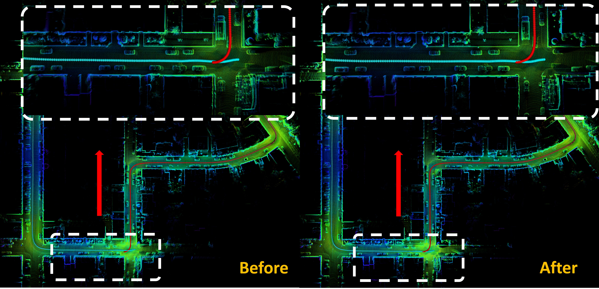
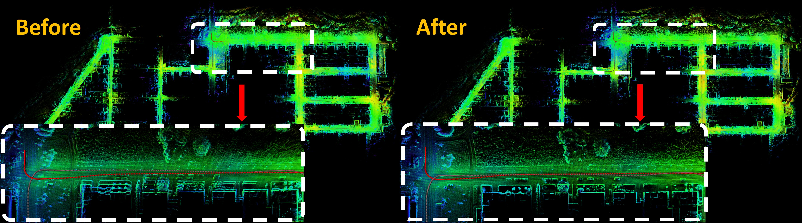

# HBA: A Globally Consistent and Efficient Large-Scale LiDAR Mapping Module Based on Hierarchical Bundle Adjustment

## **1. Introduction**
**HBA** is developed to resolve the issue that the divergence within the point cloud map cannot be fully eliminated after pose graph optimization (PGO). Though PGO is time-efficient, it does not directly optimize the mapping consistency. LiDAR bundle adjustment (BA) could mitigate this issue; however, it is too time-consuming on large-scale maps. HBA proposes a hierarchical structure to divide the huge LidAR BA problem into multiple smaller BA problems and use the PGO to smoothly update the entire LiDAR poses. HBA could achieve similar accuracy compared with the original BA method but with much less computation time.

  

    
  

  Pyramid structure of our proposed Hierarchical Bundle Adjustment.

## **2. Paper and Code**
Our paper has been accepted to [RAL](https://ieeexplore.ieee.org/abstract/document/10024300) and the corresponding video could be watched on [Bilibili](https://www.bilibili.com/video/BV1Qg41127j9/?spm_id_from=333.999.0.0) and [YouTuBe](https://youtu.be/CuLnTnXVujw). Our code will be released soon.

## **3. Applications**

### 3.1 Globally optimize the point cloud mapping consistency

#### 3.1.1 Close the loop in odometry (see our results below on KITTI sequences)

#### 3.1.2 Further optimize the mapping consistency (see our results on self-collected dataset)

### 3.2 Provide a point cloud map with centimeter-level of precision

<!-- #### 3.2.1 HILTI SLAM Challenge
HBA has participated in [HILTI SLAM Challenge](https://hilti-challenge.com/) and achieved centimeter level of precision (millimeter level in some sequences). Currently, HBA ranked #1 on leaderboard of the [HILTI SLAM Challenge 2022](https://hilti-challenge.com/leader-board-2022.html).

 -->

<!-- #### 3.2.2 MARSIM -->
[MARSIM](https://github.com/hku-mars/MARSIM) is a lightweight point-realistic simulator for LiDAR-based UAVs, to which **HBA** has contributed more than ten real-world point cloud maps with centimeter-level of precision.

## **4. Acknowledgements**
In the development of **HBA**, we stand on the state-of-the-art solution: [BALM2](https://github.com/hku-mars/BALM).